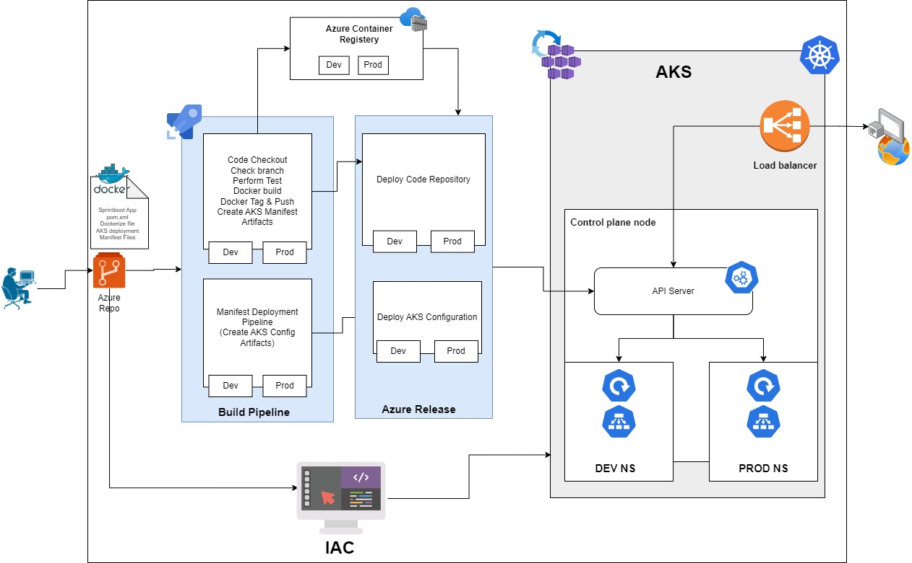
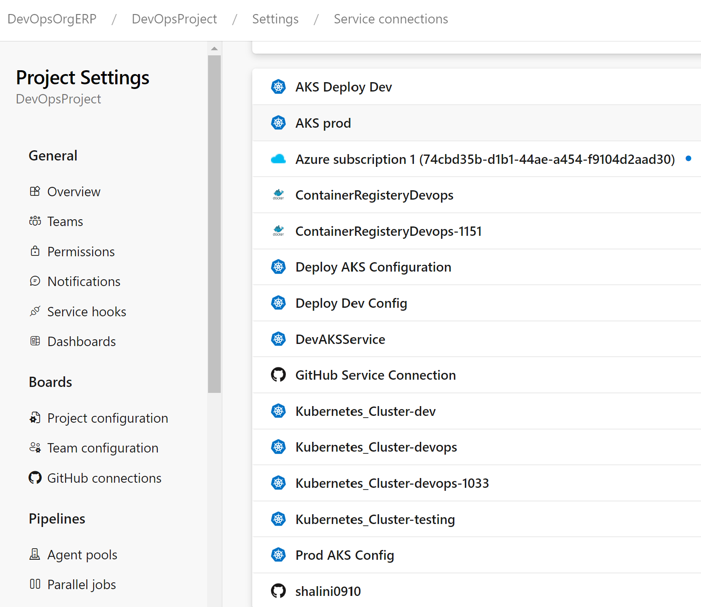

## **React SprintBoot Application Overview**

### **Objective**
As a DevOps engineer, the task is to architect and deploy an application, comprising a Java backend, React frontend with Infrastructure as a code. The goal is to build CI/CD pipelines, cloud infrastructure, and document the architecture, as well as provide automation for cleanup and scaling.

---

---

## **Solution Architecture**

### **Application Architecture**
- **Frontend**: React-based web UI hosted on a container.
- **Backend**: Java Spring-based service, containerized, and interfacing with a database.
- **Database**: Initially in-memory, with a planned migration to a managed cloud database.

### **Infrastructure Design**
- **Cloud Provider**: Azure
- **Components**:
  - Azure Kubernetes Service (AKS) for container hosting.
  - Azure Devops project to implement CICD
  - Docker tool to containerize the image
  - Azure Storage for any persistent file storage requirements.
  - Azure Virtual Networks for networking.

### **High-level Design Diagram**

# 
---

## **CI/CD Pipelines**

### **Pipeline**
- **Tasks**:
  - Build Java Spring code.
  - Unit testing and code quality checks.
  - Docker image creation.
  - Stages Creation : Dev & Prod
  - Push image to Azure Container Registry.
  - Create the Artifacts for code files.
  - Create Artifacts for AKS Configuration file.
  - Deploy to the appropriate environment (e.g., AKS or Azure App Service).

| Pipeline                  | Pipeline Status                                                                                                                                                                                                                                |
|---------------------------|------------------------------------------------------------------------------------------------------------------------------------------------------------------------------------------------------------------------------------------------|
| Code Pipeline       |  |
| AKS Config Pipeline |                          |

---

## **Infrastructure as Code (IaC) Pipeline**

### **Infrastructure Components**:
- **ARM Templates**:
  - Define infrastructure components such as virtual networks, load balancers, databases, and application hosting environments.
  
### **Cleanup and Destroy Functionality**:
- Implement functionality to tear down the infrastructure using ARM template cleanup scripts.

---

## **Monitoring and Auditing**

- **Azure Monitor**: Set up monitoring for the application and infrastructure.
- **Application Insights**: Monitor the performance and health of the deployed application.
- **Azure Policy**: Implement auditing policies to track the usage of resources and ensure compliance.

---

## **Scaling and Cloud Database**

- **Auto-scaling**: Set up auto-scaling using AKS or VM Scale Sets to handle increasing traffic and load.
- **Cloud Database**: Modify the application code to interface with a real database like Azure SQL or Cosmos DB.

---

## **Instructions for Deployment**

1. **Fork the Repository**:
   - Azure Repository.
https://dev.azure.com/DevOpsOrgERP/DevOpsProject/_git/ProjectDevOps
   - GitHub Repository
https://github.com/shalini0910/ProjectDevOps

2. **Configuration**:

   - Create AKS Cluster in azure portal or using AKS Deploy IAC file
   - Create Azure Container registery in Azure portal
   - Install the Docker tool
   - Have Azure DevOps project dashboard in https://dev.azure.com/
   - Modify K8S manifest file per ACR, image name for AKS Deployment
      - azure-pipelines-deployment.yml.
   - Modify the pipeline files as per your cloud configurations.Use the below files.
      - azure-pipelines.yml
      - aks-deploy-from-acr.yaml
      - aks-deploy-from-acr-prod.yaml

3. **Service Connection **:
   - Establish the service connection in azure devops settings as per below to connect AKS, ACR :

4. **Pipeline Execution**:
   - Follow the azure-pipelines.yml for building the pipeline and IAC for for releasing to AKS.

---

Demo :

[Watch video](https://www.youtube.com/embed/_kmy5FjpOnc?si=EEQlHfUQUrOS8kim)

